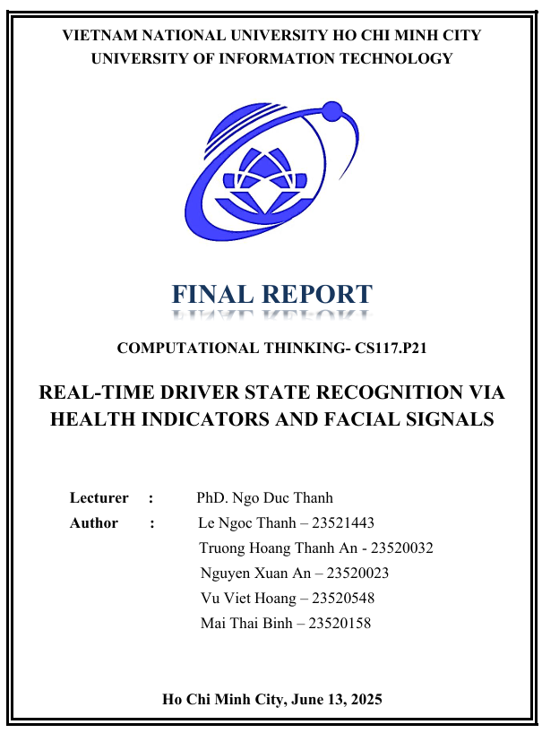
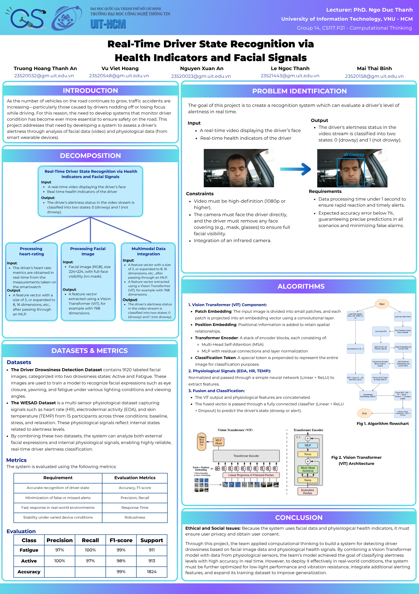

<!-- Ảnh tổng quan, căn giữa, phóng to -->

  

<!-- Ảnh poster chính thức, căn giữa, phóng to -->

  

📘 Giới thiệu
Đây là repo chứa đồ án môn học CS117 – Nhập môn Khoa học Dữ liệu, với đề tài:
"Xây dựng hệ thống nhận diện trạng thái tỉnh táo của tài xế theo thời gian thực sử dụng video khuôn mặt và tín hiệu nhịp tim".

Hệ thống được thiết kế nhằm phát hiện trạng thái buồn ngủ hoặc mất tập trung của tài xế trong thời gian thực, từ đó đưa ra cảnh báo kịp thời nhằm giảm thiểu nguy cơ tai nạn giao thông.

🛠️ Công nghệ sử dụng
Python

OpenCV – xử lý video khuôn mặt

PyTorch – huấn luyện mô hình phân loại

ViT (Vision Transformer) – trích xuất đặc trưng từ ảnh

XGBoost / Random Forest – phân tích nhịp tim

Streamlit – giao diện demo thời gian thực

📁 Cấu trúc repo
bash
Sao chép
Chỉnh sửa
CS117.P21/
├── data/               # Dữ liệu gốc: video + HR
├── models/             # Mô hình đã huấn luyện
├── scripts/            # Các file xử lý chính
├── assets/             # Ảnh poster, sơ đồ hệ thống
├── README.md           # Giới thiệu repo (file này)
└── demo_app.py         # Ứng dụng chạy demo bằng Streamlit
👨‍💻 Thành viên nhóm
Trương Hoàng Thành An - MSSV: ...

[Tên 2] - MSSV: ...

[Tên 3] - MSSV: ...

[Tên 4] - MSSV: ...

📊 Kết quả đạt được
Accuracy tổng thể: 98.5% trên tập test

Tốc độ xử lý: ~0.6 giây/frame (đạt yêu cầu thời gian thực)

Đánh giá thực tế: Hệ thống hoạt động ổn định trong điều kiện ánh sáng bình thường

📌 Hướng phát triển
Tối ưu hóa tốc độ để có thể chạy trên thiết bị nhúng (Jetson, Raspberry Pi)

Mở rộng phát hiện thêm trạng thái stress, lo âu, buồn chán,...

Hỗ trợ đa người dùng trong xe (multi-face detection)

